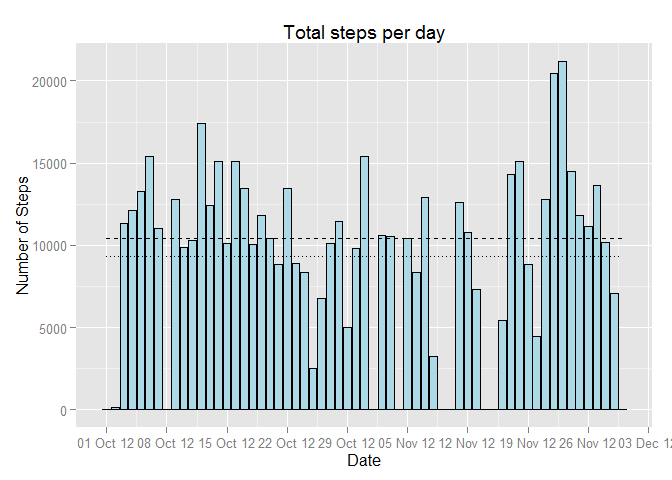
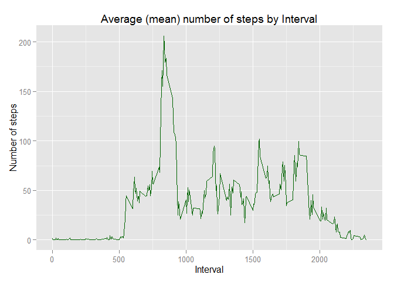
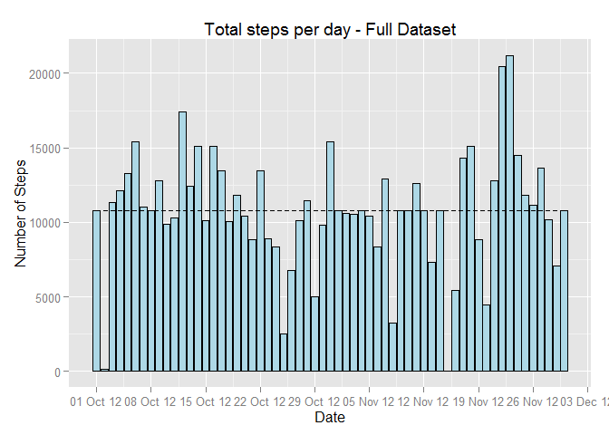
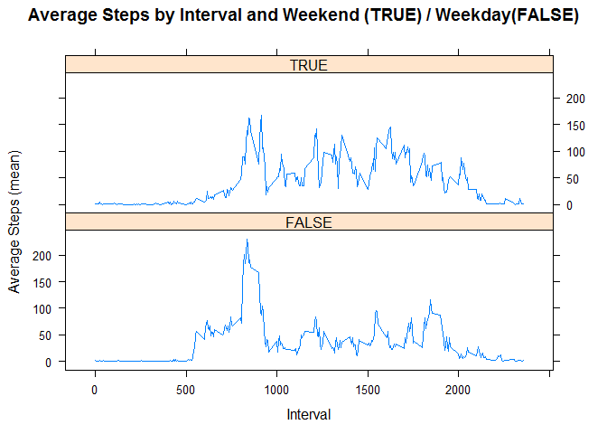

# Reproducible Research: Peer Assessment 1
## Making sure of the Library Load.

```r
library(knitr)
```

```
## Warning: package 'knitr' was built under R version 3.1.3
```

```r
library(ggplot2)#needed for plots
```

```
## Warning: package 'ggplot2' was built under R version 3.1.3
```

```r
library(scales) #needed for plots
```

```
## Warning: package 'scales' was built under R version 3.1.3
```

```r
opts_chunk$set(echo = TRUE)
```

## Loading and preprocessing the data
We'll be downloading data, unzipping it and reading as CSV.

```r
## Load data
url <- "http://d396qusza40orc.cloudfront.net/repdata%2Fdata%2Factivity.zip"
tempFile <- tempfile()
download.file(url, tempFile)
## Unzip and read the CSV file
actData <- read.csv(unz(tempFile, "activity.csv"),
                         header = TRUE)
unlink(tempFile)
## Convert columns to appropriate formats
actData$date <- as.Date(actData$date)
actData$steps <- as.numeric(actData$steps)
actData$interval <- as.numeric(actData$interval)
```

## What is mean total number of steps taken per day?
  Calculate the total Number of steps taken per day.

```r
## Aggregate sums of steps per each day into a different data frame
actDataByMonth <- aggregate(actData$steps, by = list(actData$date),FUN = sum, na.rm = TRUE)
## Set names for columns
names(actDataByMonth) <- c("date", "steps")
head(actDataByMonth,3)
```

```
##         date steps
## 1 2012-10-01     0
## 2 2012-10-02   126
## 3 2012-10-03 11352
```
  Make a histogram of the total number of steps taken each day

```r
## Making a histogram of the total number of steps taken each day
ggplot(actDataByMonth, aes(x = date, y = steps)) + 
    geom_bar(stat = "identity", fill = "lightblue", color="black", binwidth = 2000) + 
    labs(title = "Total steps per day", x = "Date", y = "Number of Steps") +
    scale_x_date(breaks = date_breaks("1 week"),
                 labels = date_format("%d %b %y")) +
    geom_line(stat="hline", yintercept=mean, linetype="dotted") +
    geom_line(stat="hline", yintercept=median, linetype="dashed")
```

 

  Calculate and report the mean and median total number of steps taken per day.  
Mean of total number of steps taken per day. Also visible on the graph as dotted line.

```r
mean(actDataByMonth$steps)
```

```
## [1] 9354.23
```
  Median of total number of steps taken per day, presented as a dashed line on the graph.

```r
median(actDataByMonth$steps)
```

```
## [1] 10395
```
## What is the average daily activity pattern?

  Make a time series plot (i.e. type = "l") of the 5-minute interval (x-axis) and the average number of steps taken, averaged across all days (y-axis)

     Aggregating means of steps taken factored by Intervals with empty values dropped.

```r
## Aggregate Average Steps by Interval
actDataByInterval <- aggregate(actData$steps, by = list(actData$interval),FUN = mean, na.rm = TRUE)

## Set names for columns
names(actDataByInterval) <- c("interval","steps")
```

   Then we build a plot using ggplot

```r
## Plot Time Series of Average Steps by Interval
ggplot(actDataByInterval, aes(x = interval, y = steps)) + 
    geom_line(color = "darkgreen") + 
    labs(title = "Average (mean) number of steps by Interval", x = "Interval", y = "Number of steps")
```

 
 
 Which 5-minute interval, on average across all the days in the dataset, contains the maximum number of steps?

```r
## Find the Index of the Max Average Steps
maxSteps <- which.max(actDataByInterval$steps)
```
   And here's the Interval which contains the maximum number of steps.

```r
## Return Data for Max Average Steps Interval
actDataByInterval[maxSteps, ]
```

```
##     interval    steps
## 104      835 206.1698
```

## Imputing missing values
  Calculate and report the total number of missing values in the dataset.

```r
## Check if steps is NA and save an index if it is
missingValues <- which(is.na(actData$steps))

## Report number of missing values
length(missingValues)
```

```
## [1] 2304
```
 
Copy a dataset into a placeholder that, is used for filling in for missing values

```r
actFullData <- actData
```
Next we'll iterate through the dataset in a loop and replace each value with a mean for that  5-minute interval as previously calculated.

```r
## Replace missing values with mean for corresponding interval
for(i in missingValues) {
    actFullData$steps[i] <- actDataByInterval[which(actDataByInterval$interval == actFullData[i, "interval"]), "steps"]
}
```
Now we'll re-calculate the aggregate number of steps per day.

```r
## aggregate sums of steps per each day into a different data frame
actFullDataByMonth <- aggregate(actFullData$steps, by = list(actFullData$date),
                            FUN = sum, na.rm = TRUE)
## set names for columns
names(actFullDataByMonth) <- c("date", "steps")
```
  Make a histogram of the total number of steps taken each day

```r
## Making a histogram of the total number of steps taken each day
ggplot(actFullDataByMonth, aes(x = date, y = steps)) + 
    geom_bar(stat = "identity", fill = "lightblue", color="black", binwidth = 2000) + 
    labs(title = "Total steps per day - Full Dataset", x = "Date", y = "Number of Steps") +
    scale_x_date(breaks = date_breaks("1 week"),
                 labels = date_format("%d %b %y")) +
    geom_line(stat="hline", yintercept=mean, linetype="dotted") +
    geom_line(stat="hline", yintercept=median, linetype="dashed")
```

 
    
    Calculate and report the mean and median total number of steps taken per day
    Mean of total number of steps taken per day.

```r
mean(actFullDataByMonth$steps)
```

```
## [1] 10766.19
```
    Median of total number of steps taken per day.

```r
median(actFullDataByMonth$steps)
```

```
## [1] 10766.19
```
   These number do indeed differ from estimation based on the original dataset with missing values. It only makes sense then sums of daily steps taken added to the dataset are driving the overall mean and median up. Also interesting to note that effect on the days that tracked lower than average number of steps was greater then on those that tracked higher than average number of steps.

## Are there differences in activity patterns between weekdays and weekends?
  Create a new factor variable, as boolean 
   First we transform the full dataset to include a new boolean factor variable. weekend is TRUE for weekend and FALSE for weekdays

```r
actFullData <- transform(actFullData, isWeekend=as.POSIXlt(date)$wday %in% c(0, 6))
```
   We then aggregate means of steps factored by both interval and weekend/weekdays variables.

```r
actFullDataByIntervalDay <- aggregate(actFullData$steps,
                                      by = list(actFullData$interval, actFullData$isWeekend),
                                      FUN = mean)
## Name columns
names(actFullDataByIntervalDay) <- c("interval","isWeekend","steps")
```
  Making a panel plot.
 Finally, we plot the average (mean) number of steps by intervals on weekends (marked as TRUE) and        weekdays (marked as FALSE)

```r
library(lattice)
xyplot(steps ~ interval|isWeekend, data = actFullDataByIntervalDay,
       type = "l", layout=c(1, 2),
       main = "Average Steps by Interval and Weekend (TRUE) / Weekday(FALSE)",
       xlab = "Interval", ylab = "Average Steps (mean)")
```

 
